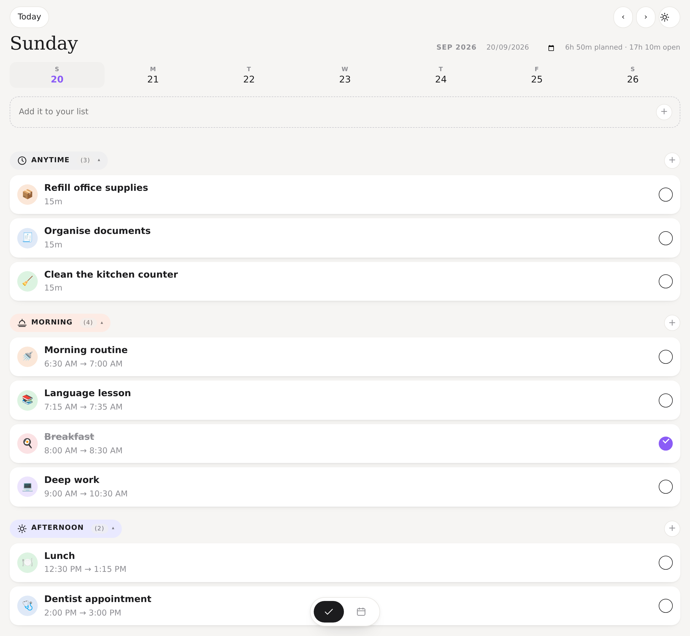
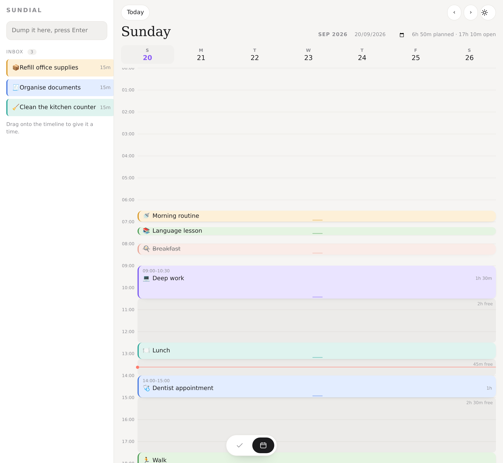
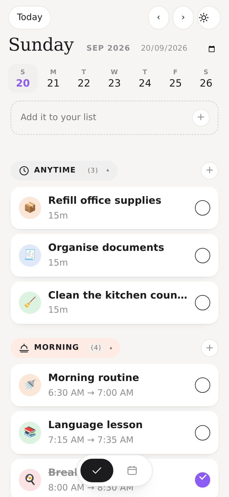
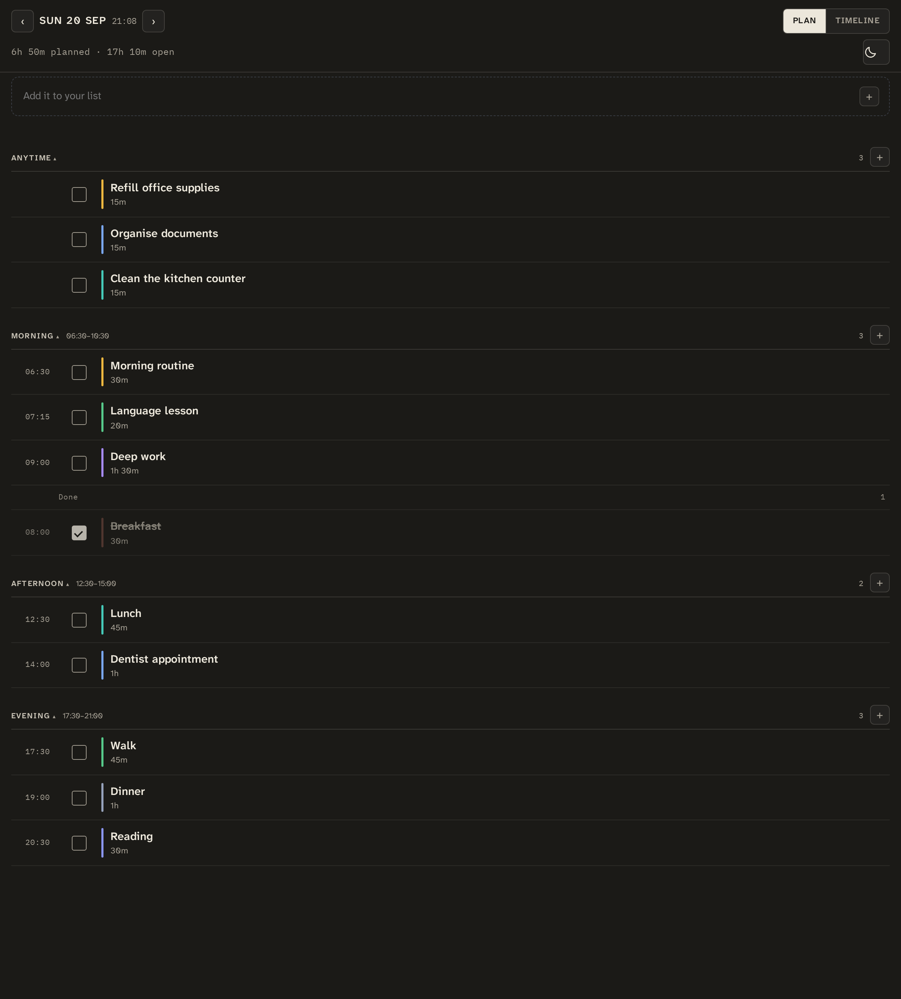

# sundial

A visual day planner that runs on your own hardware. The day is a list you can read at a
glance and a 24-hour canvas you can drag blocks around on, over one SQLite file and a
single process.


[](https://github.com/sleuthy-sloth/sundial/actions/workflows/tests.yml)
[](LICENSE)




| The 24-hour canvas | On a phone | Dark |
|:--:|:--:|:--:|
|  |  |  |

## What it does

Three destinations along the foot of the app, and it remembers which one you were in:
**Today** for the plan, **Day** for the clock, **You** for the app's own settings — connecting a
calendar among them, rather than in a column beside your day.

**Today** — the plan, and the way in. The day is cut into Anytime, Morning, Afternoon and Evening, each
with a count and the span it actually covers. Rows sit on hairlines with the time in the
gutter: a slim colour edge, the title, how long it takes, and a square to fill when it is
done. Adding to a section puts the task *after* whatever is already in that part of the
day rather than on top of it. Anytime is the inbox. At the top of the plan, one line says
what is running right now and how long is left of it, or what is next when nothing is —
that being the question you open a planner to ask.

**Day** — the clock: a 24-hour canvas. Drag a block to move it, drag its bottom edge to change
the length, double-click empty space for a short block. Above 780px the rail returns beside it,
which is where dragging a task out of the inbox and onto an hour still happens; on a phone those
same tasks are in Today's Anytime section, one tap from the editor.

**You** — the app's own settings: what is connected and how fresh it is, the theme, and which
version this copy is. Nothing here is about the day.

Shared by both: a header that reads like an instrument (the day, the time now, and which
view you are in), light and dark themes that follow your system, the free time between
tasks drawn and named rather than implied, and a detail panel for icon, colour, notes,
length, start time, done and delete. An emoji still earns its place on a timeline block,
where it helps you find one at a glance.

Install it to your phone's home screen from Safari or Chrome — it is a real PWA, with an
offline shell. It sends its own notifications: one at the hour a block begins, and nothing
else — no reminders, no summary, and no count of what you did not get to.

### The house rules

These are features, not styling:

- Nothing signals lateness with red or with urgency. A task from this morning you never
  got to simply sits there.
- No streaks, no scores, no "you missed three tasks", no confetti.
- Empty states are honest and quiet.
- 44px touch targets, and every primary action is reachable with one thumb.
- Dark mode, larger text and reduced motion are all honoured.
- **The calendar is read-only.** It comes in; nothing goes out. The worst a bug in sync can
  do is show you something wrong, and what it may delete is bounded by two rules — see
  [docs/calendar-sync.md](docs/calendar-sync.md).
- **Keyboard focus is always visible.** One `:focus-visible` ring for the whole app, never removed:
  the browser suite tabs through it and measures the ring at every stop, and axe-core runs over
  both themes, so a control that loses its indicator fails the build.

**No AI, deliberately.** No co-planner, no automatic prioritising, no suggestions. If you
do want an assistant drafting your day, point one at the API — it is a `POST /api/blocks`.

## Run it

```
bash run.sh          # builds the app if it is missing, then serves everything on :6770
```

Open <http://127.0.0.1:6770>. A fresh clone needs its dependencies first. (For the full list of
checks and the rules a change has to keep, see [CONTRIBUTING.md](CONTRIBUTING.md).)

```
python3 -m venv backend/.venv
backend/.venv/bin/pip install -r backend/requirements-dev.txt   # runtime + tests
bash scripts/setup_frontend.sh          # npm install + build
```

(If your shell exports a `PYTHONPATH`, run the pip line as `env -u PYTHONPATH …`: an
inherited one makes pip install into a hollow venv.)

## How it is put together

One Python process serves the API and the built app on the same origin, so there is no
CORS to get wrong and no second port to think about. SQLite holds the data, in WAL mode:
`scripts/backup.py` is how you copy it (see [Backup and restore](#backup-and-restore)).

### The look

Parchment ground, ink text, solar amber for now and for selection, twilight for evening —
and nothing decorative after that. Today and Day are one ledger seen two ways: a rail with a
faint hour rule, blocks hanging off a thin spine, open intervals drawn as measured, named
bands. Rows are separated by a hairline, not raised on cards; the colour you pick for a task
is a slim edge rather than a pastel bubble; completion is a square you fill rather than a
hollow circle. Time is set in IBM Plex Mono and everything else in Atkinson Hyperlegible
Next, both self-hosted, so the columns of numbers line up and nothing is fetched from
anywhere.

Contrast is measured, not guessed, and the numbers are in the comments beside each token in
`styles.css`. Nothing rests with a shadow: the only one in the app appears while you are
holding something. Motion explains time and manipulation only — a block snapping as you drag
it, a task filling its box and then leaving the list a beat later, under a reduce-motion
setting that turns all of it off.

The built app is served with an explicit cache policy rather than the browser's guess: the
shell, the manifest and the service worker must be revalidated on every request, while the
content-hashed files under `/assets` are kept for a year. That split is what lets an
upgrade arrive on the phone instead of being shadowed by yesterday's copy.

### The artwork

Three states get a picture: an empty timeline, an empty inbox, and a day that is genuinely
finished. They are the only raster images in the app. Each is drawn twice, once per theme, and
both files sit in the DOM with CSS choosing between them — so the right one is showing at the
first paint, and a dark-theme reader never sees the light one flash past. They are decorative:
each state's own sentence is still what explains it, and the artwork is hidden from a screen
reader rather than described twice.

The originals are in `art/source/`, and the files the app ships are built from them by
`scripts/make_art.py`: 800px wide, under 60KB each, and light and dark the same pixel size so
switching theme cannot move the page. The script takes the highest quality that still fits the
budget rather than a fixed one — flat line art with paper grain costs more to encode than a
photograph does, and guessing a quality number is how a budget quietly stops being met.

One step in it is worth knowing about. The supplied illustrations are drawn on their own ground,
and the dark ones are about 15/255 lighter than this app's dark ground, so putting them straight
on the canvas shows a rectangle of the wrong beige. So each file is matched to the surface it is
actually placed on — the page for the dial and the low sun, the rail's own panel colour for the
tray, because the rail is measurably lighter than the page — by shifting only the pixels within
40/255 of the original ground. The strokes, the grain and the amber beam do not move.

The dial is the exception, because it sits on the hour rules: its ground is keyed out instead, so
the rules run underneath the drawing rather than stopping at its edges. Both shapes are verified
in `--check`, along with the budgets, the matching dimensions and the absence of metadata, and CI
runs it — a change to the palette cannot quietly leave the artwork sitting on a tile.

```
env -u PYTHONPATH backend/.venv/bin/python scripts/make_art.py           # rebuild them
env -u PYTHONPATH backend/.venv/bin/python scripts/make_art.py --check   # verify the budgets
env -u PYTHONPATH backend/.venv/bin/python scripts/make_icons.py         # the icon and favicon
```

The social card is `frontend/public/brand/sundial-og.jpg` (1200x630) and the banner at the top
of this file is that directory's `sundial-readme-banner.webp` (2560x320).

### The app icon

Drawn, not traced: the dial, its twelve hour ticks, the triangular gnomon, the pedestal it stands
on and the amber shadow that gnomon casts are all geometry, and every number is a fraction of the
dial's radius measured off the reference. Nothing here carries a JPEG artefact, and the colours
are read out of `styles.css`, so the icon cannot drift from the ledger it belongs to.

It is generated in two layouts, because a launcher picks the shape rather than asking:

- **`standard`** — the dial at 78% of the canvas: 32, 48, 180, 192 and 512px, the apple-touch
  icon, and `favicon.svg`, which is the same geometry as vector.
- **`maskable`** — the dial at 70%, so the whole ring and every other element sit inside the
  central safe circle with charcoal still reaching every edge. Android may keep as little as the
  middle 70% of a maskable icon; at 78% it would take the edge of the ring.

`--check` measures where the ink actually ends in both layouts rather than trusting the geometry
to have worked out, and CI runs it. The vector and the raster are compared against each other in
the browser suite too: a browser paints the SVG and Pillow draws the PNGs, and two renderers can
drift apart without either looking wrong on its own.

**Link previews need one setting, and it belongs to the deployment rather than the repo.** The
app writes the card into its own `og:` and `twitter:` tags; with no host set those stay relative,
which a visitor's browser resolves and a crawler will not. Put
`VITE_APP_URL=https://your-host` in `frontend/.env.local` and rebuild — that file is gitignored,
and the committed `.env` leaves the value empty on purpose so nobody's build inherits somebody
else's address. One honest caveat: a host that is only reachable on a private network can be named
correctly and still not preview, because the crawlers that fetch these images are off-network.

**GitHub's repository card is a manual upload, and there is no API to avoid it.** That is not an
assumption: the Repository type exposes no social-preview field, there is no mutation for one, and
the REST API has no endpoint. It is Settings → Social preview → *Upload an image*, once, and the
file is `frontend/public/brand/sundial-og.jpg`. Changing it later means uploading again, not
committing.

```
backend/app.py              the API and the block rules (FastAPI)
backend/store.py            the database handle, so two modules can open one
backend/calendar_sync.py    iCalendar and Google JSON ⇄ the event model, and the rules (pure)
backend/env_file.py         the key=value writer both credential files use: 0600, by rename
backend/credentials.py      which keys each provider's file may hold, and what is refused
backend/calendar_errors.py  the error vocabulary both transports speak, and what each means
backend/palette.py          the eight colours, and how a foreign colour lands on one of them
backend/caldav.py           the iCloud transport: CalDAV in, event rows out. No database
backend/google_calendar.py  the Google transport: REST in, event rows out. Built, not enabled
backend/google_oauth.py     Google's consent flow: PKCE, a single-use state, a 0600 token file
backend/calendar_service.py the sync: credentials, transport, rules, database, sync_log
backend/migrations/         numbered .sql files, applied on boot
backend/spa.py              serving the built app, and how long each file may be kept
backend/export.py           the database as JSON, and putting it back
backend/test_*.py           326 tests
scripts/check_calendar.py   connect by hand, list the calendars, count what is in the window
scripts/smoke_release.py    the release path: fresh start, upgrade, restore
scripts/make_art.py         the artwork, and the budgets CI checks it against
scripts/make_icons.py       the app icon and favicon: measured geometry, two layouts
frontend/src/App.jsx        the shell: the view you are in, and where each part goes
frontend/src/hooks/          the day (usePlanner), the calendar, the pointer, the clock
frontend/src/art.js         when the all-clear artwork is allowed to appear
frontend/src/components/    Header, TabBar, Agenda, Row, Timeline, Block, Inbox, Editor,
                            Profile, Glyph, LedgerArt, CalendarPanel, Notifications, Switch,
                            YourData
frontend/src/assets/        the empty-state artwork, and the two self-hosted fonts
frontend/e2e/ui_check.mjs   226 browser checks: real mouse input, keyboard, axe, snapshots
frontend/e2e/screenshot.mjs regenerates the images above
frontend/e2e/baselines/     the visual-regression snapshots and the platform they came from
frontend/src/calendar.js    what the calendar panel says, in words, and who else is coming (pure)
frontend/src/art.test.js    unit tests for the all-clear rule (node --test)
frontend/src/calendar.test.js  unit tests for the panel's wording (node --test)
frontend/src/saving.test.js unit tests for the editing pieces (node --test)
frontend/src/time.test.js   unit tests for the day arithmetic (node --test)
frontend/src/datafile.js    what the export panel may say about a file before using it
scripts/backup.py           copy the database safely, and put a copy back
deploy/sundial.service      systemd user unit
```

The plan itself is one table, `blocks`. A block is in the inbox while its `day` and
`start_min` are NULL, and scheduled once they are set. Those two travel together — the
API refuses one without the other, because a block sitting "nowhere at 14:00" is a bug
waiting to happen.

Imported calendar events live in their own table rather than in `blocks`, because a
calendar holds things that are not plans: an all-day event is a date rather than an
instant, and a multi-day event cannot fit an invariant that says a block stays inside one
day. Keeping them apart means `blocks` keeps meaning "the day I made", and sync only has
to move rows between two shapes it owns.

## Connecting a calendar

Calendar sync is **read-only**. Your calendar comes in; nothing goes back out, so the worst a
bug in it can do is show you something wrong. The plan stays in `blocks`; this is context
beside it.

iCloud first, because it needs nothing but an app-specific password:

1. Make one at [appleid.apple.com](https://appleid.apple.com) → Sign-In and Security →
   App-Specific Passwords. Your normal Apple ID password will not work, and sundial never asks
   for it — only for the one Apple generates.
2. Open the calendar view and press **Connect**. The panel asks for the Apple ID and that
   password, and writes them into `icloud.env` next to this README at 0600. Nothing typed into
   that form comes back in an answer, goes into a log, or reaches the database.
3. Press **Sync**. Whether the password is right is the sync's answer rather than the form's, so
   that is where a wrong one shows up — as a calendar error, in the words iCloud used.

Rather use the terminal, or point it at a CalDAV server that is not iCloud? The file the panel
writes is an ordinary one, and `ICLOUD_CALDAV_URL` is only settable there:

       ICLOUD_USERNAME=you@example.com
       ICLOUD_APP_PASSWORD=xxxx-xxxx-xxxx-xxxx
       ICLOUD_CALDAV_URL=https://caldav.fastmail.com/dav/calendars/    # optional

`python scripts/check_calendar.py` connects by hand, lists the calendars it found, counts what
is in the window, and prints no credentials — not the password, not the username. `--sync`
stores them without going through the app.

What it pulls is a window: seven days back, sixty forward, recomputed at every sync. Anything
outside it is left alone, including events you already hold. Nothing needs a timer — opening
the calendar view asks the server to sync if the last one is over fifteen minutes old, and the
server decides, so switching views never hammers iCloud. `scripts/check_calendar.py --sync` is
happy under a systemd timer if you would rather it happened while nobody is looking.

### Google is built, and not switched on

There is a whole second transport in here — Google's REST API, an OAuth flow with PKCE, a
refresh token in `google.env` written 0600 — and the interface says one line: **Google
Calendar — coming soon.** That is not modesty, it is the state of it. Google's CalDAV endpoint
would have been less code, but it only accepts the full `calendar` scope, which is write access
to every calendar in the account; the REST API accepts `calendar.readonly`, so the grant itself
cannot write and "nothing goes back out" survives the credential. What is missing is a step no
code can do: somebody walking Google's console to create an OAuth client *and publish it*,
because a consent screen left in Testing has its refresh tokens revoked after exactly seven
days. Until then it refuses honestly rather than offering a button that could only fail.
`docs/calendar-sync.md` has the console steps, the two rules that stop a bad sync deleting
anything, and what is left to do.

## Backup and restore

The database runs in WAL mode, so a committed write sits in `sundial.db-wal` until a
checkpoint folds it into the main file. **Copying `sundial.db` by hand can therefore miss
the thing you just saved** — and the copy is still a valid database, so nothing complains
until you go looking for a row that is not there. Copy it through SQLite instead:

```
python3 scripts/backup.py                # writes backend/sundial-<date>.db
python3 scripts/backup.py --to ~/plans.db
```

To put one back, stop the service first:

```
systemctl --user stop sundial
python3 scripts/backup.py --restore ~/plans.db
systemctl --user start sundial
```

A restore keeps the database it replaced beside it as `sundial.replaced-<date>.db`, and
removes the old `-wal`/`-shm` files, which belong to the database being replaced rather
than the one arriving.

Back up before upgrading. Reverting to the previous version does not undo a migration:
the new schema stays, and the old code no longer knows how to read it.

### Or take it with you as JSON

A copy answers "put it back". It is not an exit: a `.db` file needs something that speaks
SQLite, it carries whichever schema you happened to be running, and you cannot read it in a
text editor or diff it. **Your data** in the settings offers the whole database as one readable
file, and takes one back:

```
curl -O -J http://127.0.0.1:6770/api/export
```

The file holds your blocks, the calendars you connected and the events read from them. It does
not hold your credentials — those are files beside the app and are never read for this — and it
does not hold **each device's notification endpoint**, which is a capability rather than
content: anything holding it can send to that phone. Importing leaves that table alone, so a
restore cannot unsubscribe the device you are restoring onto.

Importing **replaces** everything rather than merging. Merging sounds gentler and is the harder
promise — two databases with the same block id are one block or two depending on nothing the
file records, so a merge has to guess, and the guess is silent. The panel says so first, the
request has to carry `"confirm": "replace everything"`, and the database it replaces is copied
beside itself first, with the copy's path in the answer.

A file that is not an export, one from a newer sundial, one missing a table (which would
otherwise quietly delete the part it left out), one with a column sundial does not know, and one
that contradicts itself — two rows sharing an id, or an event naming a calendar it does not
carry — are all refused with a sentence, before anything is written.

## Checks

```
cd backend  && env -u PYTHONPATH .venv/bin/pytest -q   # 326 tests
cd frontend && npm test                                # 91 unit tests, node --test
cd frontend && npm run check:ui                        # 226 browser checks
env -u PYTHONPATH backend/.venv/bin/python scripts/smoke_release.py
```

One of the browser checks types a credential and the server writes it to a file, so the suite
has to be told where that file is or it refuses to run that check:

```
SUNDIAL_CHECK_ICLOUD_ENV=/tmp/icloud.env npm run check:ui -- http://127.0.0.1:6770
```

Point it at the same path the server has in `SUNDIAL_ICLOUD_ENV`, outside the checkout. Without
being told, the write would land on the server's default — which, on a box serving a real
sundial, is a real credential file.

The browser checks drive headless Chromium with real mouse input — actual drags, not
synthesised events — then read the API back to confirm the server agrees with what the
screen did. They derive their expectations from the API instead of hardcoding counts,
seed their own data, and delete exactly what they created. They also hold requests open,
answer them out of order and fail them on purpose, because a phone on a bad connection
does all three and none of it may lose what was typed.

To regenerate the screenshots above, start a second instance against a throwaway database
and run the shooter. It refuses to run against a database that already has plans in it:

```
SUNDIAL_DB=/tmp/shots.db PORT=6771 bash run.sh &
cd frontend && npm run shots
```

## Deploying

The app binds `127.0.0.1:6770` and expects something in front of it. On a tailnet, one
command gives you HTTPS that only your own devices can reach:

```
tailscale serve --bg --https=8445 http://127.0.0.1:6770
```

**There is no login.** sundial trusts whoever reaches the port, which is the right trade for
one person's planner on a private tailnet and the wrong one for anything public. Keep it on
a tailnet or behind a proxy that authenticates. `tailscale serve` is private to your own
devices; `tailscale funnel` on the same port would publish the day to the internet.

`deploy/sundial.service` is a systemd user unit — adjust the paths to where you cloned
this, then:

```
install -Dm644 deploy/sundial.service ~/.config/systemd/user/sundial.service
systemctl --user daemon-reload && systemctl --user enable --now sundial
loginctl enable-linger $USER       # so it keeps running with nobody logged in
```

Use a unit rather than a hand-started process. A process started from a shell does not
come back after a reboot, and the failure is quiet: the reverse proxy keeps its mapping
while the port behind it is empty, so the app looks dead from a phone while every check
you run on the host still passes.

## Branches

`main` is the published state. Work lands on `development` and merges into `main` when it
is ready, so what is on `main` is always a version that runs.

## Status

v0.6.0. The calendar is in the day now: the day's appointments are drawn on the timeline at the
hour their own clock says, readable in the same ink as a block and marked as not yours to move by
a dotted hairline rather than by being faded. Where an appointment and a block share an hour, the
block gives up half the column so both stay legible, and two appointments contesting that half are
split between lanes instead of covering each other. Connecting and syncing came just before this:
the profile tab takes an Apple ID and an app-specific password and the app writes the file
itself, and two
transports sit underneath, one of them switched on — iCloud syncs and is what ships, Google is
built end to end behind a "coming soon" line. Under that, the 0.2.x daylight ledger, which was
about trust rather than features: it keeps what you type, the day view describes the day
accurately, and an upgrade reaches the phone on its own. The honest gaps:

- **Google is not switched on**, as above. The transport, the consent flow, the token file and
  the error handling are written and tested; the missing piece is a person in Google's console,
  and the app says exactly that rather than failing at the last moment.
- **Nothing goes outwards.** Pushing a block out is written and tested (`block_to_ics`) and
  deliberately not wired up: nothing here writes to your calendar, on either provider.
- **Appointments on the timeline cannot be opened.** They are text, not controls: there is
  nowhere to go from one, and nothing about a block is inferred from it. An all-day event stays out of
  the column — in the rail above 780px, in the profile tab's panel below it — because it has no
  hour to sit at. A row cannot be longer than the free half allows, so
  an hour with three appointments contests a third each rather than growing the column.
- **Nothing is inferred from the calendar.** A clash shows you the over-booked hour and stops
  there — no nudging, no "reschedule this", no suggestion. It is context beside the plan, and
  the plan is still yours to change.
- No repeating tasks or routines yet.
- Notifications: the service worker is in place and listening, nothing sends yet.
- Incremental sync (RFC 6578) is not implemented: a ctag decides whether to refetch at all,
  and a refetch takes the whole window. Windows are small enough that this is honest, and
  the failure mode of a hand-rolled sync-token is a silently missing event.

MIT licensed — see [LICENSE](LICENSE).
